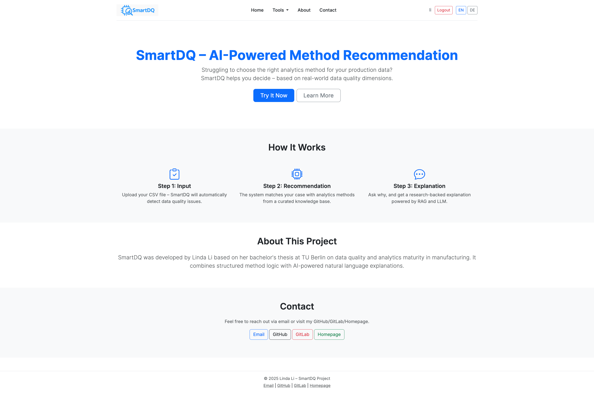
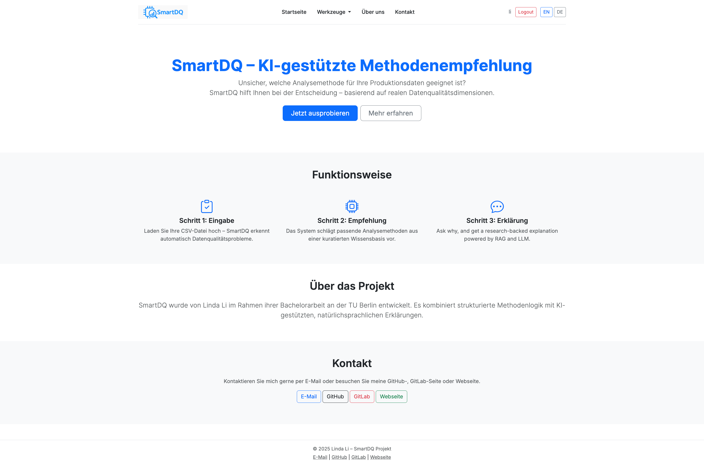
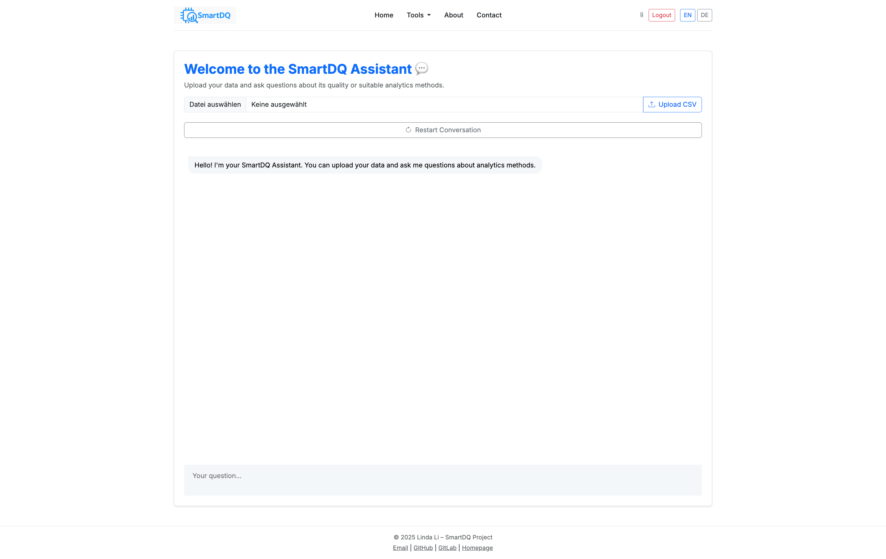
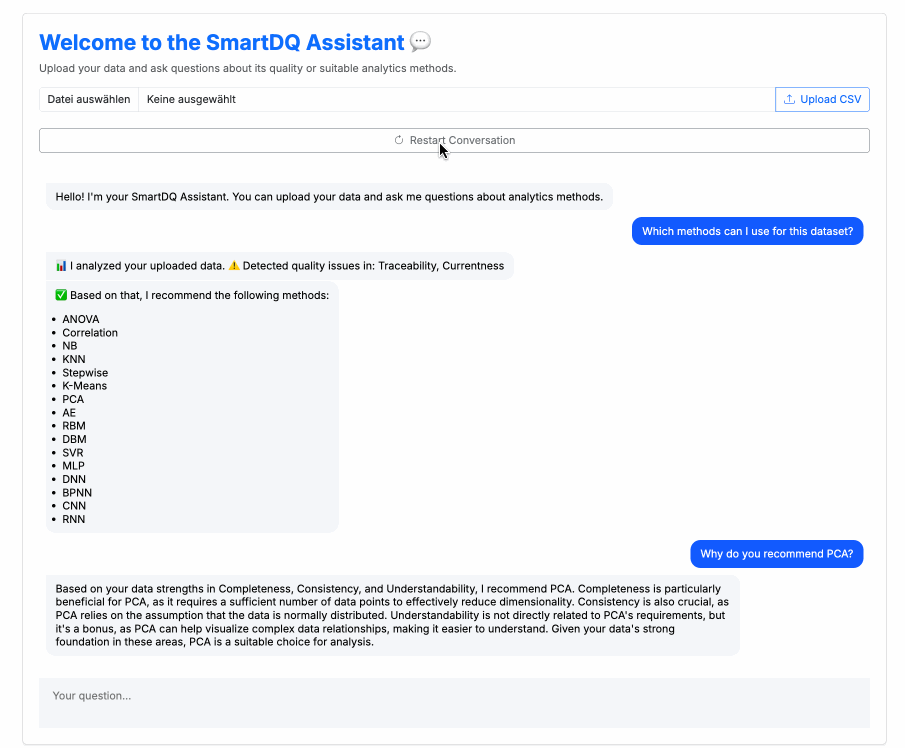

# SmartDQ – AI-Powered Method Recommendation

SmartDQ is an AI-powered web application that helps users choose suitable data analytics methods based on the quality of their uploaded CSV datasets. It combines a rule-based judgment of data quality dimensions with intelligent reasoning via LLMs.

This demo project showcases the tech stack I worked with as a student assistant at TU Berlin, and incorporates key concepts from my bachelor's thesis on method cataloging in industrial data analytics.

## Preview

> Upload CSV → Analyze data quality → Recommend method → Ask “Why?” → Get LLM explanation  

### Interface Screenshots

#### Homepage (EN)
<p align="center">
  
</p>

#### Homepage (DE)
<p align="center">
  
</p>

#### Chatbot Interface
<p align="center">
  
</p>

### Interaction Demo

<p align="center">
  
</p>


## How to Run with Docker

### 1. Clone the Repository

```bash
git clone https://github.com/yourusername/SmartDQ.git
cd SmartDQ
```

### 2. Configure Environment Variables

```bash
cp .env.example .env
```


Fill in the required variables:

- `TOGETHER_API_KEY`
- `RASA_PRO_LICENSE`

### 3. Start the Full Stack

```bash
docker-compose --env-file .env up --build
```

This will launch the following services:

- ✅ Flask web app  
- ✅ Rasa Pro server  
- ✅ Custom RAG backend (for LLM integration)  
- ✅ Rasa action server (for method recommendation logic)


## Tech Stack

| Layer       | Technology                                 |
|-------------|---------------------------------------------|
| Web Backend | Flask                                       |
| Frontend    | HTML, CSS, JS + Rasa Webchat                |
| Chatbot     | Rasa Pro + custom actions                   |
| LLM         | Together.ai (LLaMA3-11B via custom RAG API) |
| i18n        | Flask-Babel (English / German)    |
| Deployment  | Docker & Docker Compose                     |


## Known Limitations & Future Work

### Language Support

- Currently, the chatbot only responds in **English**.
- The interface supports multilingual selection, but bot responses are not yet localized to German or Chinese.

### File Upload Feedback

- File upload currently triggers a separate popup.
- In future versions, this should be replaced with direct Rasa feedback confirming upload success.

### Data Quality Dimension Rules

- **Implemented**: Completeness, Consistency, Traceability, Understandability, Currentness  
- **To be added**: Accuracy, Credibility, Precision, Accessibility, Efficiency  
- Rules for remaining dimensions will be added in upcoming versions.

### Scenario-Based Recommendation

- Currently, method recommendation is based only on data quality dimensions.
- Future versions will incorporate **application context** (e.g., predictive maintenance, quality control) for more accurate suggestions.
